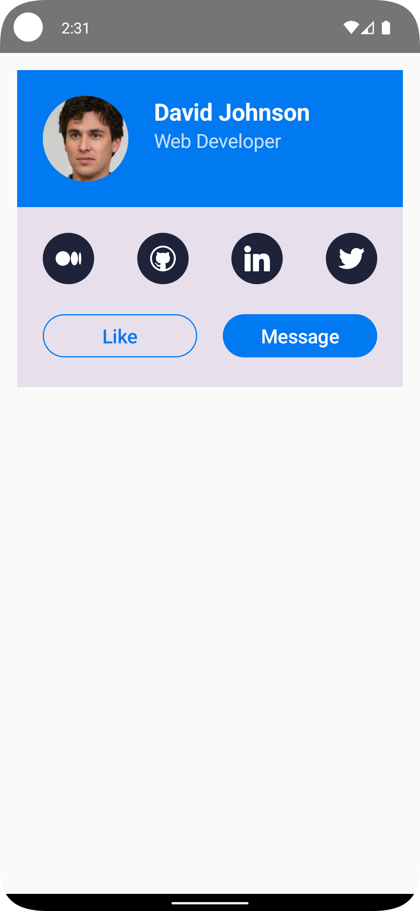

# ProfileCardComposable

  

## Medium Article

This project is accompanied by a detailed Medium article titled "Intermediate Android Compose - Profile Card." You can read the article [here]().

## Overview

`ProfileCardComposable` is an Android UI built using Jetpack Compose. This project showcases the development of a `ProfileCard()` composable.

Key features of the `ProfileCard()` include:

- Modular Design: The ProfileCard() is divided into separate components like `ProfileHeader()`, `SocialMediaIcons()`, and `ProfileActionButtons()`, enhancing code maintainability, readability, and collaboration efficiency.
- Customization and Flexibility: Offers extensive customization options for each component, including colors, text, images, and shapes, ensuring that the profile card can be easily tailored to fit any app's design and branding needs.
- Efficient Image Handling with Coil: Utilizes Coil for image loading, offering efficient processing and caching of images, which is crucial for performance in image-heavy UI components.
- Interactive Elements: Incorporates interactive UI elements like social media icon buttons and action buttons, providing a dynamic user experience.
- Adaptive Layout: Designed with responsive principles, ensuring the `ProfileCard()` looks great across different screen sizes and orientations.
- Modern UI with Jetpack Compose: Built using Jetpack Compose, the latest UI toolkit for Android, leveraging the benefits of a declarative UI approach for more intuitive and concise UI code.
- Previews for Development Ease: Includes Composable Preview functions for each component, facilitating rapid and iterative development by allowing developers to see changes in real time.
- Simple Color Theming: Offers a straightforward theming system with primary, secondary, and tertiary colors to easily adjust the overall appearance of the card.
- Scalability and Reusability: The modular nature of the components makes them reusable in different parts of the app, reducing redundancy and facilitating scalability.

## Getting Started

1. Clone the repository to your local machine.
2. Open the project in Android Studio (preferably the latest version for full Compose support).
3. Run the app on an emulator or physical device to see the app in action.
